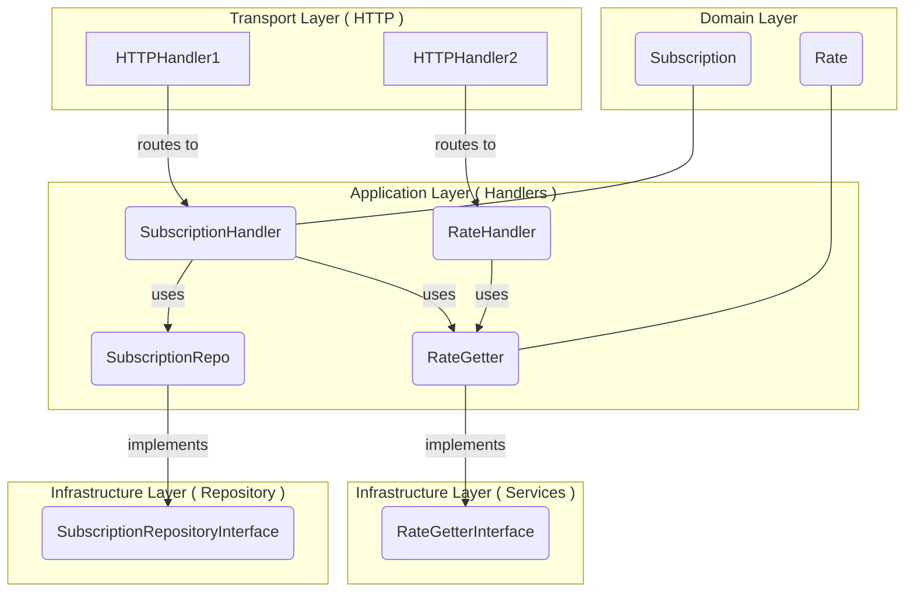

# Genesis Software Engineering School 3.0

## Docs

[gses2swagger.yaml](docs%2Fgses2swagger.yaml)

## Introduction

The application is divided into several key modules as detailed below:

- **cmd**: Contains the application's entry point.
- **data**: Contains file store, or raw data.
- **docs**: Contains documentation files.
- **internal**: Contains the core application logic divided into `rate`, `subscription`, and `transport` packages.
- **scripts**: Contains auxiliary scripts for various tasks.
- **sys**: Contains system-level packages like `config`, `filestore`, and `logger`.

Each module is responsible for a specific function within the application, allowing for clear separation of concerns and
making the codebase easy to manage and navigate.

## Installation and Setup

To get started with `gentest`, you need to have Go installed on your machine.

1. Clone the repository.
2. Navigate to the cloned directory.
3. Run to install the necessary dependencies.

```shell
make install
```

4. Start the application by running

```shell
go run cmd/main.go
# or
make run
```

5. Build docker image by running

```shell
make docker-build
 ``` 

6. Run docker image by running

```shell
make docker-run
 ```  

## Module Tree

```
📦gentest
 ┣ 📂cmd
 ┃ ┗ 📜main.go
 ┣ 📂data
 ┣ 📂docs
 ┣ 📂internal
 ┃ ┣ 📂rate
 ┃ ┃ ┣ 📜getter_mock_test.go
 ┃ ┃ ┣ 📜handler.go
 ┃ ┃ ┣ 📜handler_test.go
 ┃ ┃ ┣ 📜rate.go
 ┃ ┃ ┗ 📜rate_test.go
 ┃ ┣ 📂subscription
 ┃ ┃ ┣ 📜handler.go
 ┃ ┃ ┣ 📜handler_test.go
 ┃ ┃ ┣ 📜repository.go
 ┃ ┃ ┣ 📜subscriber_mock_test.go
 ┃ ┃ ┗ 📜subscription.go
 ┃ ┗ 📂transport
 ┃   ┣ 📜http.go
 ┃   ┣ 📜handler_test.go
 ┃   ┗ 📜middleware.go
 ┣ 📂scripts
 ┣ 📂sys
 ┃ ┣ 📂config
 ┃ ┃ ┣ 📜config.go
 ┃ ┃ ┗ 📜config_test.go
 ┃ ┣ 📂filestore
 ┃ ┃ ┣ 📜filestore.go
 ┃ ┃ ┗ 📜filestore_test.go
 ┃ ┗ 📂logger
 ┃   ┗ 📜logger.go
 ┣ 📜.env
 ┣ 📜.gitignore
 ┣ 📜Dockerfile
 ┣ 📜go.mod
 ┣ 📜go.sum
 ┣ 📜Makefile
 ┗ 📜README.md
```

## Project Architecture (in progress...)

