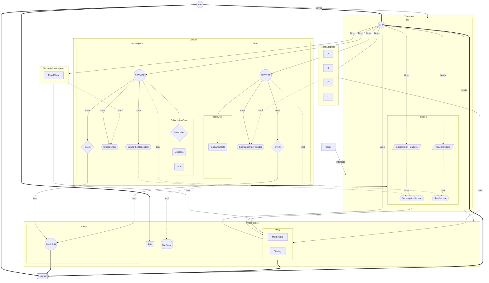
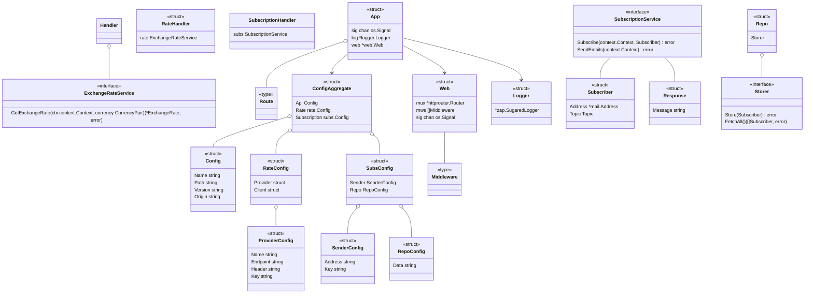
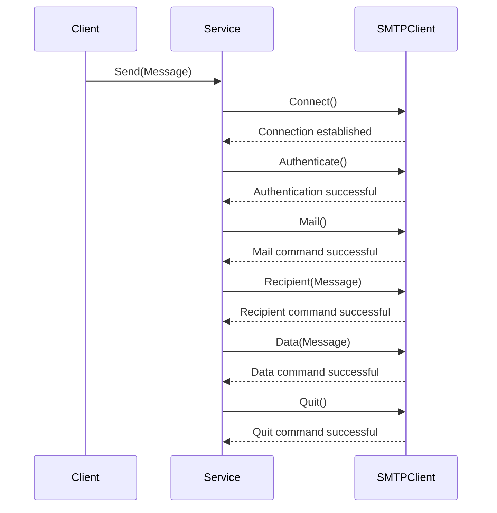

t # Genesis Software Engineering School 3.0

## Doc

[openapi.yaml](doc%2Fopenapi.yaml)

## Introduction

The application is divided into several key modules as detailed below:

- **cmd**: Contains the application's entry point.
- **data**: Contains file store, or raw data.
- **docs**: Contains documentation files.
- **internal**: Contains the core application logic divided into `rate`, `subscription`, and `transport` packages.
- **scripts**: Contains auxiliary scripts for various tasks.
- **sys**: Contains system-level packages like `env`, `filestore`, and `logger`.

Each module is responsible for a specific function within the application, allowing for clear separation of concerns and
making the codebase easy to manage and navigate.

## Installation and Setup

```shell
make install
```

```shell
make run
```

```shell
make docker-build
 ``` 

```shell
make docker-run
 ```  

## Module Tree
--- TODO: Update
```
📦xrate
 ┣ 📂.github
 ┃ ┗ 📂workflows
 ┃   ┣ 📜go.yml
 ┃   ┗ 📜golangci.yml
 ┣ 📂api
 ┃ ┣ 📜api.go
 ┃ ┣ 📜config.go
 ┃ ┗ 📜routes.go
 ┣ 📂cmd
 ┃ ┗ 📜main.go
 ┣ 📂doc
 ┃ ┗ 📜openapi.yaml
 ┣ 📂internal
 ┃ ┣ 📂rate
 ┃ ┃ ┣ 📜config.go
 ┃ ┃ ┣ 📂curxrt
 ┃ ┃ ┃ ┣ 📜alphavantage.go
 ┃ ┃ ┃ ┣ 📜coinapi.go
 ┃ ┃ ┃ ┣ 📜coinyep.go
 ┃ ┃ ┃ ┣ 📜curxrt.go
 ┃ ┃ ┃ ┣ 📜ninjas.go
 ┃ ┃ ┃ ┗ 📜xratehost.go
 ┃ ┃ ┣ 📜event.go
 ┃ ┃ ┣ 📜handler.go
 ┃ ┃ ┗ 📜rate.go
 ┃ ┗ 📂subs
 ┃   ┣ 📜config.go
 ┃   ┣ 📜event.go
 ┃   ┣ 📜handler.go
 ┃   ┣ 📜repo.go
 ┃   ┣ 📜repo_test.go
 ┃   ┣ 📜sender.go
 ┃   ┗ 📜subs.go
 ┣ 📂log
 ┃ ┗ 📜sys.log
 ┣ 📂sys
 ┃ ┣ 📂env
 ┃ ┃ ┣ 📜env.go
 ┃ ┃ ┗ 📜env_test.go
 ┃ ┣ 📂event
 ┃ ┃ ┗ 📜event.go
 ┃ ┣ 📂filestore
 ┃ ┃ ┣ 📜filestore.go
 ┃ ┃ ┗ 📜filestore_test.go
 ┃ ┣ 📂logger
 ┃ ┃ ┗ 📜logger.go
 ┃ ┗ 📂web
 ┃   ┣ 📜errors.go
 ┃   ┣ 📜middlewares.go
 ┃   ┣ 📜middlewares_test.go
 ┃   ┣ 📜params.go
 ┃   ┣ 📜request.go
 ┃   ┣ 📜respond.go
 ┃   ┗ 📜web.go
 ┣ 📂test
 ┃ ┣ 📂mock
 ┃ ┃ ┣ 📜email_repository.go
 ┃ ┃ ┣ 📜email_sender.go
 ┃ ┃ ┣ 📜getter.go
 ┃ ┃ ┗ 📜subscriber.go
 ┃ ┣ 📜Dockerfile
 ┃ ┗ 📜postman.json
 ┣ 📜.gitignore
 ┣ 📜.golangci.yml
 ┣ 📜Dockerfile
 ┣ 📜Makefile
 ┣ 📜README.md
 ┣ 📜docker-compose.yml
 ┣ 📜go.mod
 ┗ 📜go.sum

```

## Architecture


## Entities 
--TODO: Finish



## Sending Emails
